# Companah — Supabase Schema Architecture (v4)

*Updated with field-level mapping from the Companah Operations Airtable base. Now includes logistics schema for delivery/pickup route tracking with a dedicated locations entity.*

## Overview

This document outlines a proposed Postgres schema structure for Companah's Supabase project, designed to serve four applications from a single database:

**Internal apps:**
- Pricing Dashboard
- Workflow & Task Management

**External apps:**
- Veterinary Partner Portal
- Direct Care Client Dashboard

The schema is organized into **Postgres schemas** (namespaces) to keep concerns separated while sharing core data.

---

## Schema Organization

```
companah (Supabase project)
├── core          — Shared entities: people, pets, organizations, locations
├── pricing       — Service catalog, price lists, pricing rules (incl. QBO Products)
├── orders        — Cremation orders, order lifecycle, care plans, memorials
├── operations    — Cremation machines, processing runs, chemical tracking
├── billing       — QBO integration, invoices, payment tracking
├── workflows     — Tasks, assignments, statuses
├── partners      — Vet partner-specific data, referrals, portal config
├── clients       — Client-facing portal access, review tracking
└── logistics     — Delivery/pickup routes, stops, and item tracking
```

Supabase's built-in `auth` schema handles authentication. Each app connects to the same project but queries different schemas based on role and RLS policies.

---

## How Airtable Tables Map to Supabase

| Airtable Table | Supabase Schema | Notes |
|----------------|-----------------|-------|
| **Pets** (90+ fields) | `core.pets` + `orders.orders` + `orders.care_plans` + `orders.memorial_items` | The mega-table gets decomposed into its logical parts |
| **Clients** | `core.contacts` (role = 'owner') + `clients.portal_access` + `clients.reviews` | Owner-specific data separated from portal/review tracking |
| **Veterinarians** | `core.organizations` + `partners.profiles` | Practice info in core, partner-specific config in partners |
| **Vet Partner Table** | `partners.profiles` (portal fields) | Merges with Veterinarians into a single org + profile model |
| **App Users** | `core.contacts` + `auth.users` | All user types in one contacts table with auth linkage |
| **Donatello / Michelangelo / Leonardo** | `operations.machines` + `operations.runs` + `operations.run_pets` | Three identical table structures become one generic model |
| **QBO Invoices** | `billing.invoices` | Invoice header data with QBO sync fields |
| **QBO Invoice Table** | `billing.invoice_line_items` | Line-item detail for invoice generation |
| **QBO Products** | `pricing.products` | Product/service catalog with SKUs and QBO account mapping |

---

## Entity Relationship Diagram

```mermaid
erDiagram
    %% ══════════════════════════════════════════════
    %% CORE SCHEMA — Shared across all apps
    %% ══════════════════════════════════════════════

    core_organizations {
        uuid id PK
        text name
        text type "vet_partner | companah | facility"
        text abbreviation "Vet Abbr from Airtable"
        text phone
        text email
        text address_line_1
        text address_line_2
        text city
        text state
        text zip
        text region "Central NC | Sandhills | Piedmont"
        text notes
        text logo_url
        timestamptz created_at
        timestamptz updated_at
    }

    core_contacts {
        uuid id PK
        uuid organization_id FK "nullable for direct clients"
        text first_name
        text last_name
        text email
        text phone
        text address_line_1
        text address_line_2
        text city
        text state
        text zip
        text role "owner | vet_staff | admin | team_member"
        uuid auth_user_id "links to auth.users"
        text region "Central NC | Sandhills | Piedmont"
        timestamptz created_at
        timestamptz updated_at
    }

    core_pets {
        uuid id PK
        uuid owner_id FK "references core_contacts"
        text name
        text species "dog | cat | bird | reptile | other"
        text breed
        text color
        text gender "male | female"
        numeric weight_lbs
        date date_of_passing
        text special_instructions
        jsonb images "Supabase Storage URLs"
        jsonb pet_pic "dedicated pet photo"
        timestamptz created_at
        timestamptz updated_at
    }

    %% ══════════════════════════════════════════════
    %% PRICING SCHEMA — Service catalog & rates
    %% ══════════════════════════════════════════════

    pricing_products {
        uuid id PK
        text name "Product/Service Name"
        text description "Sales Description"
        text sku
        text category "cremation | addon | urn | keepsake | paw_print | delivery"
        text product_type "service | non_inventory"
        numeric default_price "Sales Price / Rate"
        boolean is_taxable
        text qbo_income_account "maps to QBO Income Account"
        text qbo_expense_account
        boolean is_active
        timestamptz created_at
        timestamptz updated_at
    }

    pricing_partner_rates {
        uuid id PK
        uuid organization_id FK "which vet partner"
        text service_type "individual | communal"
        text weight_range "0-25 | 26-50 | 51-100 | 100+"
        numeric rate "wholesale rate"
        date effective_from
        date effective_to
        timestamptz created_at
    }

    %% ══════════════════════════════════════════════
    %% ORDERS SCHEMA — Cremation lifecycle
    %% ══════════════════════════════════════════════

    orders_orders {
        uuid id PK
        text companah_id "human-readable CMP-XXXXXXXX"
        text nfc_id "NFC tag ID"
        uuid pet_id FK
        uuid client_contact_id FK
        uuid vet_organization_id FK "nullable - referring vet"
        text attending_doctor
        text status "preplanning | on_hold | awaiting_pickup | received | triage | cremation | complete | delivered"
        text service_type "private | communal | semi_private | biodegradable | memorials_only"
        text intake_location "home | apex_care_center | sanford_care_center | gso_care_center | clinic"
        text companah_location "hq_apex | hq_greensboro | hq_sanford_foh | hq_sanford_boh | hq_raleigh | in_transit"
        text current_location "fv_freezer | sanford_freezer | gso_freezer | vehicle"
        date date_received
        date cremation_date
        date date_returned
        date planned_return
        text delivery_method "primary_care | other_vet | direct_to_owner | owner_pickup"
        text pickup_location "hq_sanford | hq_raleigh | hq_greensboro | hq_apex"
        text return_location
        boolean is_vet_referral "was this referred by a vet partner"
        text notes
        text intake_email "original referral email"
        text referring_vet_info
        text special_case
        boolean is_stalled
        text intake_pdf_url
        text care_plan_url
        timestamptz created_at
        timestamptz updated_at
    }

    orders_line_items {
        uuid id PK
        uuid order_id FK
        uuid product_id FK "references pricing_products"
        text description
        numeric quantity
        numeric unit_price
        numeric total
        timestamptz created_at
    }

    orders_care_plans {
        uuid id PK
        uuid order_id FK
        boolean is_completed
        text completed_pdf_url "Supabase Storage"
        text vessel "tree_of_life_sm | tree_of_life_md | lovt_mdf_sm | etc"
        text memorial_package "tree_of_life_urn | biodegradable | wilmington"
        integer clay_prints
        integer nose_prints
        integer engraved_prints
        integer shadowbox_prints
        boolean engraved_on_urn
        text engraving_text
        boolean memorial_plan_requested
        boolean memorial_plan_sent
        boolean clay_prints_completed
        text memorial_items_list
        text retained_items
        timestamptz created_at
        timestamptz updated_at
    }

    orders_memorials {
        uuid id PK
        uuid order_id FK
        uuid pet_id FK
        text tribute_text
        jsonb photo_urls "Supabase Storage URLs"
        boolean is_public
        timestamptz created_at
        timestamptz updated_at
    }

    %% ══════════════════════════════════════════════
    %% OPERATIONS SCHEMA — Cremation processing
    %% (Donatello, Michelangelo, Leonardo)
    %% ══════════════════════════════════════════════

    operations_machines {
        uuid id PK
        text name "Donatello | Michelangelo | Leonardo"
        text machine_type "alkaline_hydrolysis | flame | etc"
        text facility "which location"
        boolean is_active
        timestamptz created_at
    }

    operations_runs {
        uuid id PK
        uuid machine_id FK
        integer process_number "auto-incrementing per machine"
        date run_date
        numeric koh_weight_lbs "potassium hydroxide"
        numeric naoh_weight_lbs "sodium hydroxide"
        numeric bulk_weight_lbs
        text slack_confirmation "confirmed | not_confirmed"
        text slack_user
        jsonb attachments "Supabase Storage URLs"
        timestamptz created_at
        timestamptz updated_at
    }

    operations_run_pets {
        uuid id PK
        uuid run_id FK
        uuid order_id FK "links to the cremation order"
        numeric pet_weight_lbs "captured at time of run"
        timestamptz created_at
    }

    %% ══════════════════════════════════════════════
    %% BILLING SCHEMA — QBO integration layer
    %% ══════════════════════════════════════════════

    billing_invoices {
        uuid id PK
        uuid order_id FK "nullable - some invoices span orders"
        uuid client_contact_id FK "nullable - for direct clients"
        uuid vet_organization_id FK "nullable - for vet partners"
        text qbo_invoice_id "QuickBooks Online ID"
        text qbo_invoice_number
        text qbo_customer_id
        text qbo_customer_name
        text qbo_customer_email
        date invoice_date
        date due_date
        text terms "on_receipt | net_30 | net_60"
        numeric invoice_amount
        numeric balance_due
        text status "draft | sent | paid | overdue | void"
        date most_recent_payment
        text memo
        timestamptz created_at
        timestamptz updated_at
    }

    billing_invoice_line_items {
        uuid id PK
        uuid invoice_id FK
        uuid product_id FK "references pricing_products"
        text description
        numeric quantity
        numeric rate
        numeric amount
        date service_date
        boolean is_taxable
        text tax_rate
        text shipping_address
        timestamptz created_at
    }

    %% ══════════════════════════════════════════════
    %% WORKFLOWS SCHEMA — Task management
    %% ══════════════════════════════════════════════

    workflows_templates {
        uuid id PK
        text name "e.g. Standard Private Cremation"
        text description
        jsonb steps "ordered list of step definitions"
        boolean is_active
        timestamptz created_at
    }

    workflows_tasks {
        uuid id PK
        uuid order_id FK "nullable"
        uuid template_id FK "nullable"
        text title
        text description
        text status "pending | in_progress | blocked | done"
        text priority "low | normal | high | urgent"
        uuid assigned_to FK "references core_contacts"
        date due_date
        timestamptz completed_at
        timestamptz created_at
        timestamptz updated_at
    }

    workflows_comments {
        uuid id PK
        uuid task_id FK
        uuid author_id FK "references core_contacts"
        text body
        timestamptz created_at
    }

    %% ══════════════════════════════════════════════
    %% PARTNERS SCHEMA — Vet partner portal
    %% ══════════════════════════════════════════════

    partners_profiles {
        uuid id PK
        uuid organization_id FK
        text tier "standard | preferred | premium"
        text billing_method "per_order | monthly_invoice"
        numeric wholesale_rate_individual
        numeric wholesale_rate_communal
        text qbo_customer_id "links to QBO"
        text qbo_current_invoice_id
        text magic_link_url "portal access link"
        integer rating "1-5 partner rating"
        text user_type "vet | owner"
        jsonb portal_preferences
        timestamptz created_at
        timestamptz updated_at
    }

    partners_referrals {
        uuid id PK
        uuid partner_profile_id FK
        uuid order_id FK
        uuid referring_contact_id FK
        date referred_date
        text notes
        timestamptz created_at
    }

    %% ══════════════════════════════════════════════
    %% CLIENTS SCHEMA — Client portal & reviews
    %% ══════════════════════════════════════════════

    clients_portal_access {
        uuid id PK
        uuid contact_id FK
        uuid order_id FK
        text access_token
        text temp_password "hashed"
        timestamptz expires_at
        timestamptz last_accessed_at
        timestamptz created_at
    }

    clients_reviews {
        uuid id PK
        uuid contact_id FK
        uuid order_id FK
        text review_status "needs_request | request_sent | review_done | possible_negative"
        boolean review_request_sent
        text review_notes
        date review_sent_date
        timestamptz created_at
        timestamptz updated_at
    }

    %% ══════════════════════════════════════════════
    %% LOGISTICS SCHEMA — Delivery & pickup tracking
    %% ══════════════════════════════════════════════

    logistics_locations {
        uuid id PK
        text name "e.g. Fuquay Animal Hospital"
        uuid organization_id FK "nullable - links to core_organizations if a partner"
        text location_type "vet_clinic | client_home | companah_facility | other"
        text address_line_1
        text address_line_2
        text city
        text state
        text zip
        text region "Central NC | Sandhills | Piedmont"
        text contact_name "who to ask for on arrival"
        text contact_phone
        text hours "e.g. M-F 8a-6p, Sat 9a-1p"
        text access_notes "e.g. Use side entrance after 5pm, check in at front desk"
        boolean is_active "still in use?"
        timestamptz created_at
        timestamptz updated_at
    }

    logistics_routes {
        uuid id PK
        date route_date
        text route_name "e.g. Tuesday AM Central NC"
        uuid driver_id FK "references core_contacts"
        text vehicle "vehicle identifier"
        text status "planned | in_progress | completed | cancelled"
        text region "Central NC | Sandhills | Piedmont"
        timestamptz started_at
        timestamptz completed_at
        text notes
        timestamptz created_at
        timestamptz updated_at
    }

    logistics_stops {
        uuid id PK
        uuid route_id FK
        uuid location_id FK "references logistics_locations"
        integer stop_order "sequence on the route: 1, 2, 3..."
        text stop_type "pickup | delivery | both"
        text override_address "one-off address if not using a saved location"
        timestamptz arrived_at
        timestamptz departed_at
        text status "pending | arrived | completed | skipped"
        text notes "stop-specific notes for this visit"
        timestamptz created_at
        timestamptz updated_at
    }

    logistics_stop_items {
        uuid id PK
        uuid stop_id FK
        uuid order_id FK "the cremation order"
        text action "pickup | delivery"
        text item_description "e.g. Pet remains, Memorial urn + prints"
        text status "pending | completed"
        text notes
        timestamptz created_at
    }

    %% ══════════════════════════════════════════════
    %% RELATIONSHIPS
    %% ══════════════════════════════════════════════

    %% Core
    core_organizations ||--o{ core_contacts : "has staff/members"
    core_contacts ||--o{ core_pets : "owns"

    %% Pricing
    core_organizations ||--o{ pricing_partner_rates : "has custom rates"

    %% Orders
    core_pets ||--|| orders_orders : "cremation for"
    core_contacts ||--o{ orders_orders : "requested by"
    core_organizations ||--o{ orders_orders : "referred by"
    orders_orders ||--o{ orders_line_items : "includes"
    pricing_products ||--o{ orders_line_items : "product"
    orders_orders ||--|| orders_care_plans : "care plan"
    orders_orders ||--o| orders_memorials : "memorial for"
    core_pets ||--o| orders_memorials : "remembered in"

    %% Operations
    operations_machines ||--o{ operations_runs : "processes"
    operations_runs ||--o{ operations_run_pets : "contains"
    orders_orders ||--o{ operations_run_pets : "processed in"

    %% Billing
    orders_orders ||--o{ billing_invoices : "billed via"
    core_contacts ||--o{ billing_invoices : "billed to"
    core_organizations ||--o{ billing_invoices : "billed to"
    billing_invoices ||--o{ billing_invoice_line_items : "contains"
    pricing_products ||--o{ billing_invoice_line_items : "product"

    %% Workflows
    orders_orders ||--o{ workflows_tasks : "tracked by"
    workflows_templates ||--o{ workflows_tasks : "generated from"
    core_contacts ||--o{ workflows_tasks : "assigned to"
    workflows_tasks ||--o{ workflows_comments : "discussed in"
    core_contacts ||--o{ workflows_comments : "authored by"

    %% Partners
    core_organizations ||--|| partners_profiles : "partner config"
    partners_profiles ||--o{ partners_referrals : "generates"
    orders_orders ||--o{ partners_referrals : "originated from"
    core_contacts ||--o{ partners_referrals : "referred by"

    %% Clients
    core_contacts ||--o{ clients_portal_access : "can access"
    orders_orders ||--o{ clients_portal_access : "viewable via"
    core_contacts ||--o{ clients_reviews : "reviewed by"
    orders_orders ||--o{ clients_reviews : "reviewed for"

    %% Logistics
    core_organizations ||--o{ logistics_locations : "physical location of"
    core_contacts ||--o{ logistics_routes : "drives"
    logistics_routes ||--o{ logistics_stops : "visits"
    logistics_locations ||--o{ logistics_stops : "stop at"
    logistics_stops ||--o{ logistics_stop_items : "handles"
    orders_orders ||--o{ logistics_stop_items : "picked up or delivered"
```



---

## Schema Details

### `core` — Shared Entities

The backbone of the database. Every app reads from these tables.

| Table | Purpose | Airtable Source |
|-------|---------|-----------------|
| **organizations** | Vet clinics, Companah locations, cremation facilities. The `type` field distinguishes them. Includes address, region, logo, and abbreviation. | Veterinarians, Vet Partner Table |
| **contacts** | All people — pet owners, vet staff, Companah team members, app users. Linked to `auth.users` for login. The `role` field controls what they can see. | Clients, App Users, plus owner fields from Pets |
| **pets** | The animals. Linked to their owner. Includes species, breed, color, gender, weight, and date of passing. Images stored in Supabase Storage. | Pet-specific fields from Pets table |

### `pricing` — Service Catalog & Rates

Powers the **Pricing Dashboard**. Replaces the QBO Products table and adds structured partner rate management.

| Table | Purpose | Airtable Source |
|-------|---------|-----------------|
| **products** | The full catalog — cremation types, urns, keepsakes, paw prints, delivery fees. Includes SKU, QBO account mapping, and default price. | QBO Products |
| **partner_rates** | Per-partner wholesale rates by service type and weight range. Supports effective date ranges for rate changes over time. | Wholesale Rate fields from Veterinarians |

### `orders` — Cremation Order Lifecycle

The transactional heart. This is where the Airtable Pets mega-table gets properly decomposed.

| Table | Purpose | Airtable Source |
|-------|---------|-----------------|
| **orders** | A cremation order from intake to delivery. Tracks status, service type, locations (intake, current, companah), dates, delivery method, NFC tag, and all the operational fields. | Status, Service Type, dates, locations, delivery, notes from Pets |
| **line_items** | What's included in an order — services and products with prices captured at time of order. | Derived from order + pricing |
| **care_plans** | The care plan for each order — vessel selection, print counts, engraving details, memorial package, and completion status. | Care Plan, Memorial, Vessel, Print fields from Pets |
| **memorials** | Tribute pages with photos and text, optionally public. | Memorial fields from Pets + new feature |

### `operations` — Cremation Processing

**New schema** — not in the original proposal. Models the three cremation machines and their processing runs.

| Table | Purpose | Airtable Source |
|-------|---------|-----------------|
| **machines** | Registry of cremation equipment. Currently Donatello, Michelangelo, and Leonardo. Extensible for new machines. | Three separate Airtable tables → one generic model |
| **runs** | A single processing run on a machine. Tracks date, chemical weights (KOH, NaOH), bulk weight, Slack confirmation, and attachments. | Run Date, chemical weights, Slack fields from each machine table |
| **run_pets** | Junction table linking orders to runs. A run can contain multiple pets (communal), and captures weight at time of processing. | Pets linked record field from each machine table |

### `billing` — QuickBooks Online Integration

**New schema** — separates billing/invoicing into its own domain with explicit QBO sync fields.

| Table | Purpose | Airtable Source |
|-------|---------|-----------------|
| **invoices** | Invoice headers with QBO IDs, customer info, amounts, and payment status. Can link to an order, a client, or a vet partner. | QBO Invoices |
| **invoice_line_items** | Individual line items on an invoice — product, quantity, rate, service date, tax status. Structured for QBO CSV export or API sync. | QBO Invoice Table |

### `workflows` — Internal Task Management

Powers the **Workflow & Task Management** app.

| Table | Purpose | Airtable Source |
|-------|---------|-----------------|
| **templates** | Reusable workflow blueprints (e.g., "Standard Private Cremation" has steps: receive, tag, cremate, package, notify, deliver). | New — not in current Airtable |
| **tasks** | Individual work items, optionally linked to an order and generated from a template. Assigned to team members. | New — replaces informal tracking |
| **comments** | Discussion on tasks. | New |

### `partners` — Veterinary Partner Portal

| Table | Purpose | Airtable Source |
|-------|---------|-----------------|
| **profiles** | Partner-specific config — tier, billing terms, wholesale rates, QBO linkage, magic link for portal access, rating, and portal preferences. | Vet Partner Table + Veterinarians wholesale fields |
| **referrals** | Tracks which orders came through which partner and who referred them. | Derived from Vet? checkbox and Veterinarians link on Pets |

### `clients` — Direct Care Client Dashboard

| Table | Purpose | Airtable Source |
|-------|---------|-----------------|
| **portal_access** | Token-based or temp-password access for clients to check order status. Supports expiring links. | Ready for Adalo, Temp Pass from Clients |
| **reviews** | Tracks the review request lifecycle — whether a review has been requested, sent, completed, or flagged as potentially negative. | Review Status, Review Request Sent, Review Notes from Clients |

### `logistics` — Delivery & Pickup Route Tracking

**New schema** — not previously tracked in Airtable. Models the physical movement of pets and memorials between locations, with a dedicated locations directory.

| Table | Purpose | Airtable Source |
|-------|---------|-----------------|
| **locations** | A directory of places Companah visits — vet clinics, client homes, facilities. Stores the name, address, hours, access notes (where to go, who to ask for), and a link to `core.organizations` if the location is a partner. Created once, reused across every route that visits that place. | New — not in current Airtable |
| **routes** | A delivery/pickup trip. Tracks the driver, date, vehicle, region, status, and start/end times. A route like "Tuesday AM Central NC" is one row. | New — not in current Airtable |
| **stops** | Each location visited on a route, in sequence order. Points to a saved location (or uses an override address for one-off stops). Tracks arrival/departure times and whether the stop was a pickup, delivery, or both. | New — not in current Airtable |
| **stop_items** | Junction table connecting stops to orders. Records what happened at each stop — which pet was picked up or which memorial was delivered. A stop at a vet clinic might have 3 pickups and 2 deliveries as separate items. | New — not in current Airtable |

---

## Relationship Mapping: Airtable → Supabase

Every record link in the Airtable base has been mapped to its Supabase equivalent. All 13 unique relationships are covered.

| # | Airtable Relationship | Supabase Equivalent | How It Works |
|---|----------------------|---------------------|-------------|
| 1 | Pets → Clients | `core_pets.owner_id → core_contacts.id` | Many-to-one FK. A pet belongs to one owner. |
| 2 | Pets → Veterinarians | `orders_orders.vet_organization_id → core_organizations.id` | The vet referral is an order-level relationship, not pet-level. |
| 3 | Pets → Vet Partner Table | Eliminated — Veterinarians + Vet Partner Table merge into `core_organizations` + `partners_profiles` | Portal-specific fields live in `partners_profiles`, linked via `organization_id`. |
| 4 | Pets → Donatello | `operations_run_pets` junction table | `run_pets.order_id → orders.id` + `run_pets.run_id → runs.id`. The machine is on the run, not the junction. |
| 5 | Pets → Michelangelo | Same `operations_run_pets` table | All three machines share one generic model. Machine identified via `runs.machine_id`. |
| 6 | Pets → Leonardo | Same `operations_run_pets` table | Same pattern. Adding a 4th machine = adding a row, not a table. |
| 7 | Pets → QBO Invoices | `billing_invoices.order_id → orders_orders.id` | Invoice links to the order, which links to the pet. The pet→invoice path is derived. |
| 8 | Pets → QBO Products (3 links) | `orders_line_items.product_id → pricing_products.id` | Three Airtable links (QBO Invoice, Worksheet, QBO SKUs) all resolve to the same concept: which products are on this order. |
| 9 | Veterinarians → QBO Invoices | `billing_invoices.vet_organization_id → core_organizations.id` | Direct FK on the invoice to the vet org. |
| 10 | Veterinarians → QBO Products | `pricing_partner_rates.organization_id → core_organizations.id` | Partner-specific pricing handled by dedicated rates table, not a direct product→vet link. |
| 11 | Veterinarians → QBO Invoice Table | Derived through `billing_invoices.vet_organization_id` | Line items → invoices → vet org. No direct FK needed. |
| 12 | Veterinarians → App Users | `core_contacts.organization_id → core_organizations.id` | App Users become `core_contacts` with `role = 'vet_staff'`. |
| 13 | QBO Invoice Table → QBO Products | `billing_invoice_line_items.product_id → pricing_products.id` | Direct FK from line item to product. |

### Key Structural Improvements Over Airtable

- **Pets mega-table decomposed**: The single 90+ field Pets table splits into `core_pets` (the animal), `orders_orders` (the job), `orders_care_plans` (memorial/vessel details), and related billing tables. Relationships that were implicit in Airtable become explicit foreign keys.
- **Three machine tables → one generic model**: Donatello, Michelangelo, and Leonardo become rows in `operations_machines` with runs tracked in a shared `operations_runs` table. No schema changes needed to add new equipment.
- **Two vet tables → one org + profile**: Veterinarians and Vet Partner Table merge. Practice info lives in `core_organizations`, partner-specific config (wholesale rates, portal, tier) lives in `partners_profiles`.
- **Many-to-many links → proper FKs**: Airtable defaults everything to many-to-many. In Supabase, most relationships are properly modeled as many-to-one FKs, with junction tables only where truly needed (run_pets).

---

## Row Level Security (RLS) Strategy

Each schema should have RLS policies scoped by role:

| Role | Access |
|------|--------|
| **companah_admin** | Full access to all schemas |
| **companah_team** | Read/write on `core`, `orders`, `operations`, `workflows`. Read on `pricing`, `billing`. |
| **vet_partner** | Read on their own `partners` profile, referrals, and related orders. Read on their own `billing` invoices. No access to other partners, operations, or internal workflows. |
| **client** | Read-only on their own orders and memorials via `clients` schema. No access to pricing, workflows, operations, or partner data. |

---

## Key Airtable Fields Intentionally Not Migrated

Some fields in the Airtable base are artifacts of workarounds, integrations, or legacy processes that won't be needed in Supabase:

| Field/Pattern | Reason to Skip |
|---------------|----------------|
| **Trello ID / Card ID / Create Trello Card** | Trello integration replaced by `workflows` schema |
| **Multiple "copy" fields** (Pets copy, Pets copy, Pets copy) | Airtable sync artifacts — not needed with proper relational joins |
| **Adalo-specific fields** (Ready for Adalo, Temp Pass formula) | Will be replaced by Supabase auth + `clients.portal_access` |
| **Zapier/automation trigger checkboxes** (Create CP Draft, Send Review SMS, Create Invoice Item) | Replaced by Supabase Edge Functions or database triggers |
| **Duplicate lookup fields** | Airtable requires lookups; Postgres uses joins |
| **Formula fields for display** (Pet Name formula, Label Print Name) | Computed at query time or in the app layer |

---

## What's Next

1. **Validate with real data** — Export a sample of Pets records and map each field to the new schema to confirm nothing meaningful is lost.
2. **Define QBO sync strategy** — Decide whether invoicing is mastered in QBO (with Supabase as a read cache) or in Supabase (with QBO as the sync target). This affects whether `billing` tables are writable or read-only.
3. **Design Edge Functions** — Replace Airtable automations (Zapier triggers, checkbox-based workflows) with Supabase Edge Functions or database triggers.
4. **File storage plan** — Map all attachment fields (images, PDFs, logos) to Supabase Storage buckets with appropriate access policies.
5. **Migration script** — Build an ETL pipeline to transform Airtable records into the new schema, handling the Pets table decomposition carefully.
6. **Reporting views** — Create Postgres views for common dashboard queries (revenue by partner, orders by status, machine utilization, etc.).
